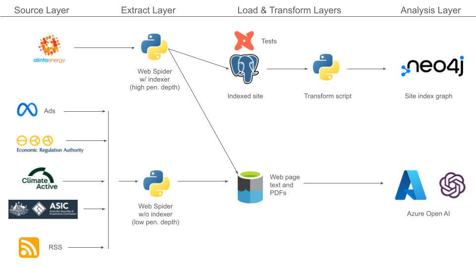

# Introduction
This project is a fun web scraping project to analyze existing company business strategies and compare and contrast strategies between competitors. This project aims to scrape data from a variety of publicly web data sources which can then be sent to Azure Open AI for easy analysis. For this project I have chosen Alinta Energy as an example company to analyse, but the framework provided is robust and can be reused for any company desired. 

For fun I have also added a Neo4j graph to index the Alinta website.

While I currently work for a competitor company (Synergy), Synergy is by no means affiliated with this hobby project. I take full responsibility for any and all work undertaken in this project. 

# Data Sources
Publicly available data sources used in this project include:

* [The Australian Economic Regulation Authority (ERA) website](https://www.erawa.com.au/). Used to get public regulatory data.
* [The Alinta Energy website](https://www.alintaenergy.com.au/). For general company strategy data.
* [Meta Ads Library](https://www.facebook.com/ads/library/?active_status=all&ad_type=political_and_issue_ads&country=AU&media_type=all). To determine the marketing segments for the company.
* [The Australian Securities and Investments Commission (ASIC) website](https://asic.gov.au/). For financial statements.
* [The Australian Climate Active website](https://www.climateactive.org.au/). To determine if the company has put forward any climate or emissions related targets.
* A news RSS feed to get the latest statements. 

# Example Analysis Questions
There's a vast wealth of questions that can be asked using the scraped data sources above. A few example questions to ask may include:

* What unique value propositions and strengths does the company emphasize in their marketing?
* Who is the company marketing to?
* Are there any recent changes or innovations in product offerings? Are they leveraging any new emerging technologies to gain a competitive edge?
* Have there been any regulatory non-compliance incidents? If so, how do these incidents impact company strategy? Do the incidents point to a deeper company issue?
* Is there any publicly available data on product pricing? If so, how does it compare to competitors?
* How does the company address sustainability and corporate social responsibility (CSR)? Are there any climate or emissions related targets for the company? Is the company meeting it's targets?

# Architecture

# A Note On Ethical Web Scraping
As part of ethical web scraping practices please note the following:

* I do not own any of this data. Data collected in this project is strictly for a fun hobby project and is not to be used for commercial purposes.
* I consulted the robots.txt page for each website before starting this project. The pages used for web scraping are not included in any robots.txt page.
* I have added a random sleep statement of 30-80 seconds between requests as a courtesty to avoid overloading the web servers.
* The number of requests to each web server will be limited by the penetration depth of the web spider. I am still working to define the optimal depth. 

# Future Work
This project is just a beginning and there is a huge amount of work that can be done in the competitor analysis space. While this project provides analysis at a strategic level, I would like to look at more tactical items moving forward. Thus, ideas for future work include:

* Analysing Alinta's bidding behaviour into the Western Australian electricity market.
* A predictive model for Alinta power generation plant outages. 
* Reverse engineering contracted fuel pricing for Alinta's gas generators to improve upon existing electricity market modelling.
